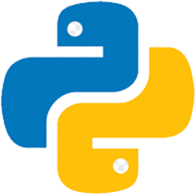
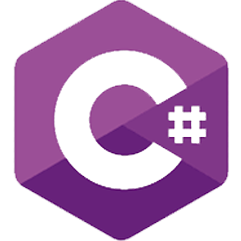
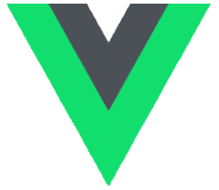
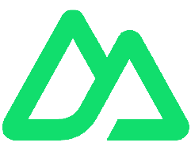
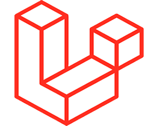
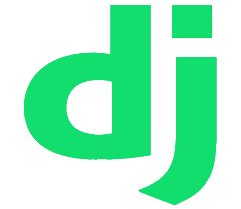
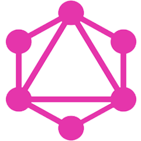
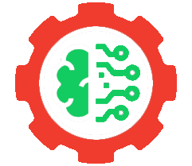
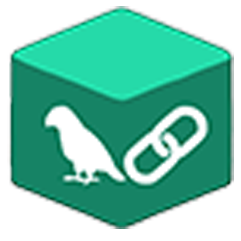
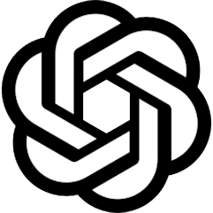

<!DOCTYPE html>
<html>

<body>
  <h1 align="center"> 👋 Sr. Web & AI Developer </h1>

  

  

    
  

  <h1 align="center">
    
    
    
  </h1>

  
  

  

    
    
  

   

  <h1 align="center">About Me</h1>

  <ul dir="auto">
    <li>
      <g-emoji class="g-emoji" alias="bank"
        fallback-src="https://github.githubassets.com/images/icons/emoji/unicode/1f3e6.png"></g-emoji> My most recent
      job ended last month, so I'm currently available and can fully dedicate myself to your project.
    </li>
    <li>
      <g-emoji class="g-emoji" alias="thinking"
        fallback-src="https://github.githubassets.com/images/icons/emoji/unicode/1f914.png"></g-emoji> I love
      coding—it's my passion and a big part of my life.
    </li>
    <li>
      <g-emoji class="g-emoji" alias="speech_balloon"
        fallback-src="https://github.githubassets.com/images/icons/emoji/unicode/1f4ac.png"></g-emoji> I enjoy taking on
      new challenges and never let difficulties discourage me.
    </li>
    <li>
      <g-emoji class="g-emoji" alias="smile"
        fallback-src="https://github.githubassets.com/images/icons/emoji/unicode/1f604.png"></g-emoji> Pronouns: He/Him
    </li>
  </ul>
   

  <h1 align="center">𝐒𝐤𝐢𝐥𝐥 𝐒𝐞𝐭</h1>
  
These are some of the major technologies that I use or have worked on in the past.

  

    

      
<strong>Programming Languages</strong>

      

        
        
        
        
        
        
        
      

    

    

      
<strong>Frontend</strong>

      

        
        
        
        
        
        
        
      

    

    

      
<strong>Backend</strong>

      

        
        
        
        
        
        
        
      

    

    

      
<strong>AI</strong>

      

        
        
        
        
        
      

    

    

      
<strong>Database</strong>

      

        
        
        
      

    

    

      
<strong>Cloud & Tools</strong>

      

        
        
        
        
      

    

  

   
  <h1 align="center">
    Thank you for visiting my page!
    
  </h1>

</body>

</html>